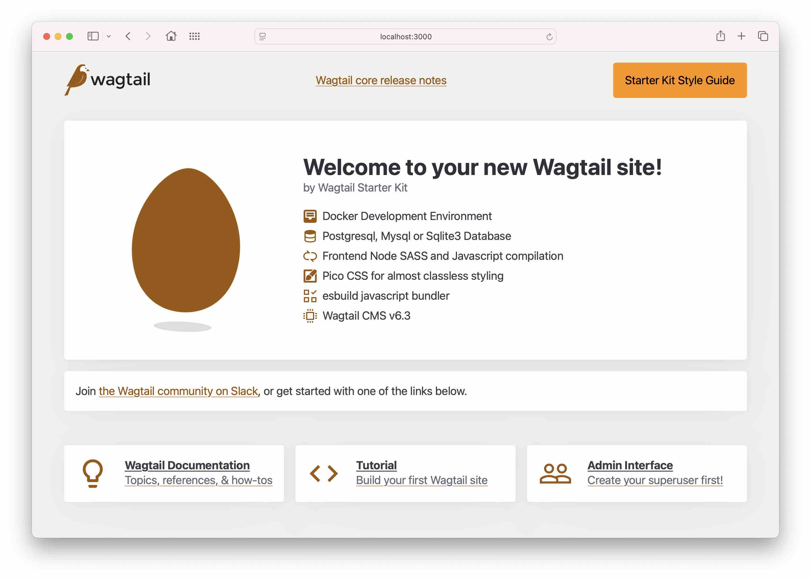

# Wagtail Shop Kit

An e-commerce starter kit built with Wagtail CMS and Django. This project provides a foundation for building online shops with a powerful content management system.

## Features

- **Wagtail CMS v7.2** - Powerful, flexible content management
- **Django v5.2** - Robust Python web framework
- **Docker Development Environment** - Containerized setup for consistency
- **Multiple Database Options** - PostgreSQL, MySQL, or SQLite3
- **Modern Frontend Stack** - SASS, esbuild, and Pico CSS
- **E-commerce Ready** - Built with shop functionality in mind



## Quick Start

```bash
# Copy environment file and configure
cp .env.example .env

# Build and start the project
make quickstart

# Create admin user
make superuser
```

The site will be available at [http://localhost:8000](http://localhost:8000)

## Documentation

- **[Installation Guide](./docs/installation.md)** - Detailed setup instructions
- **[Backend Development](./docs/backend-development.md)** - Database configuration and backend development
- **[Frontend Development](./docs/frontend-development.md)** - CSS/JS build process and styling
- **[Management Commands](./docs/management-commands.md)** - Helpful commands for development

## Technology Stack

- Python 3.10+
- Django 5.2
- Wagtail 7.2
- Docker & Docker Compose
- Node.js (SASS & esbuild)
- Pico CSS

## License

This project is licensed under the MIT License - see the [LICENSE](LICENSE) file for details.
